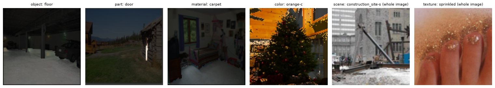
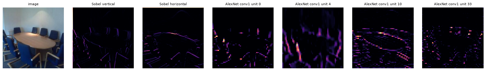
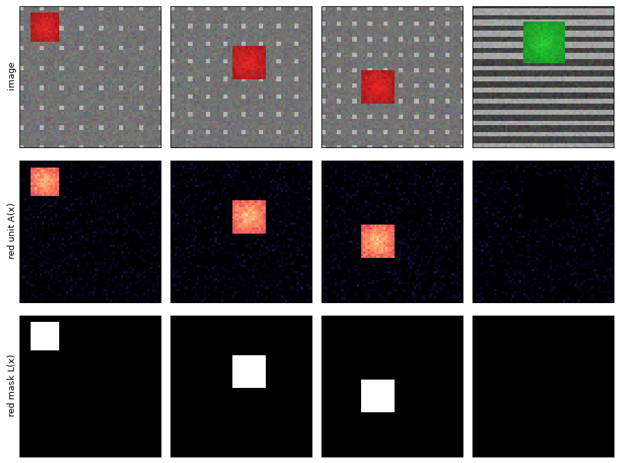

# tiny_netdissect

A step by step reproduction of **Network Dissection: Quantifying Interpretability of Deep Visual Representations** (Bau, Zhou, Khosla, Oliva, Torralba, CVPR 2017), built to understand the method one piece at a time. Notebooks are added one at a time as each step is reviewed.

Paper: [arXiv:1704.05796](https://arxiv.org/abs/1704.05796), [CVPR 2017 open access](https://openaccess.thecvf.com/content_cvpr_2017/html/Bau_Network_Dissection_Quantifying_CVPR_2017_paper.html), local copy [`Network_dissection.pdf`](Network_dissection.pdf). Original code: [CSAILVision/NetDissect](https://github.com/CSAILVision/NetDissect), [NetDissect-Lite](https://github.com/CSAILVision/NetDissect-Lite).

## The method in one paragraph

Every channel (unit) of a convolutional layer is treated as a binary segmenter. Its activation map is upsampled to image resolution and thresholded at the unit's own top 0.5% quantile. The resulting masks are compared with pixel annotations of 1,197 visual concepts (objects, parts, materials, colors, scenes, textures) from the Broden dataset, using an intersection over union summed over the whole dataset. A unit whose best IoU exceeds 0.04 is a detector for that concept, and a layer is summarized by its number of unique detected concepts.

## Contents

Each notebook isolates one idea of the method with a small side by side comparison.

| # | Notebook | Idea | Comparison | Paper |
|---|---|---|---|---|
| 00 | [`00_broden_exploration`](00_broden_exploration.ipynb) | the concept dataset | file format, categories, label encoding | Sec. 2.1, Table 1 |
| 01 | [`01_units_and_hooks`](01_units_and_hooks.ipynb) | a unit and its activation map | vertical vs horizontal edge unit, hand made vs learned | Sec. 2.2 |
| 02 | [`02_concepts_as_masks`](02_concepts_as_masks.ipynb) | concepts as pixel sets | pixel labels vs image labels | Sec. 2.1 |

Notebooks 00 and 01 use the real Broden dataset. Notebook 02 uses synthetic scenes (one colored shape on a striped or dotted background) where every concept mask is exact.

### 00. The concept dataset

Broden labels six categories of concepts. Objects, parts, materials and colors are pixel masks, scenes and textures are whole image labels. One example per category, with the labeled region kept bright:



### 01. A unit and its activation map

A unit is one output channel of a conv layer: one kernel and the map it produces on an image. Forward hooks read these maps without changing the network. Two hand made Sobel units next to four units learned by the first layer of AlexNet, on the same Broden image:



### 02. Concepts as masks

A concept becomes a mask of the pixels that show it. A hand made "red" unit (top: image, middle: its map) lights up where the red mask is (bottom), and stays dark on a green shape:



## Setup

Python 3.12 and [uv](https://docs.astral.sh/uv/).

```bash
git clone git@github.com:Aer-3888/tiny_netdissect.git
cd tiny_netdissect
uv venv --python 3.12 .venv
uv pip install --python .venv/bin/python -r requirements.txt
.venv/bin/jupyter lab
```

Everything runs on CPU. AlexNet ImageNet weights (233 MB) are downloaded by torchvision on first use.

## Data

Broden 1.0 at 227 px (975 MB), used by notebooks 00 and 01. The original server `netdissect.csail.mit.edu` is offline, a copy is kept by the [Wayback Machine](https://web.archive.org/web/20240418040425/http://netdissect.csail.mit.edu/data/broden1_227.zip). It is slow and sometimes unavailable, so download it once with a resumable tool:

```bash
mkdir -p data && curl -L -C - -o data/broden1_227.zip \
  "https://web.archive.org/web/20240418040425id_/http://netdissect.csail.mit.edu/data/broden1_227.zip"
unzip -q data/broden1_227.zip -d data
```

`data/` is ignored by git.

## Citation

This repository reproduces the following paper. Cite the original work:

D. Bau, B. Zhou, A. Khosla, A. Oliva, A. Torralba. *Network Dissection: Quantifying Interpretability of Deep Visual Representations*. Proceedings of the IEEE Conference on Computer Vision and Pattern Recognition (CVPR), 2017, pp. 6541-6549.

```bibtex
@InProceedings{Bau_2017_CVPR,
  author    = {Bau, David and Zhou, Bolei and Khosla, Aditya and Oliva, Aude and Torralba, Antonio},
  title     = {Network Dissection: Quantifying Interpretability of Deep Visual Representations},
  booktitle = {Proceedings of the IEEE Conference on Computer Vision and Pattern Recognition (CVPR)},
  month     = {July},
  year      = {2017},
  pages     = {6541--6549}
}
```

## License

GPL-3.0, see [`LICENSE`](LICENSE). Broden and the pretrained weights keep their own licenses.
